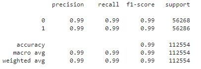

# Credit Risk Analysis 

## Overview 
To minimize credit risk to the overall lending portfolio for a peer-to-peer lending services company, a machine learning model was built and evaluated to determine its ability to identify credit risk. 

The machine learning model was built using historical lending activities data. The "loan_status" column identified healthy (0) and high risk of default (1) loans and was used as the Target Labels set in building our model and the remaining data used as the Features set.

## Results
To evaluate each model's performance, the balanced accuracy score was calculated and a classification report was run for each model.

### Machine learning model 1:

Balanced accuracy score: 0.9442676901753825 or 94% 

Classification Report:

### Machine learning model 2:
Balanced accuracy score: 0.994180571103648 or 99% 

Classification Report:

## Summary
In summary, model 2 performs with more precision and accuracy than model 2. Using the random sample generator for model 2 provided a balanced data sample and the confusion matrix provided a higher precision of true positive results. This model can more accurately predict healthy and high risk of default loans. 
