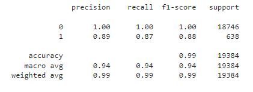

# Credit-risk-classifications Challenge
Using historical lending activity from a peer-to-peer lending services company, this challenged required me to build a model that can identify the creditworthiness of borrowers.
The instructions for this challenge are divided into the following subsections:

  * Split the Data into Training and Testing Sets

  * Create a Logistic Regression Model with the Original Data

  * Predict a Logistic Regression Model with Resampled Training Data

  * Write a Credit Risk Analysis Report: 

### Split the Data into Training and Testing Sets
To begin the challenge, I read the `lending_data.csv` data from the Resources folder into a Pandas DataFrame.
Created the labels set (y) from the “loan_status” column, and then create the features (X) DataFrame from the remaining columns.
  
  * A value of 0 in the "loan_status" column indicates that a loan is healthy. 
  
  * A value of 1 in the "loan_status" column indicates that a loan has a high risk of default.

Once the data was review, I split the data into training and testing datasets by using `train_test_split`.

### Create a Logistic Regression Model with the Original Data
Next, I fit a logistic regression model by using the training data (`X-train` and `y_train`). I saved the predictions for the testing data lables by using the testing feature data(`X_test`) and the fitted model.

### Evaluated Model 1's performance
I then evaluated the model's prefromance by doing the following:

 * Calcuated the accuracy score of the model. 
 
 The accuracy score of this model: 0.9924164259182832 or 99%. 
 
 A balance score report was also calculated. The balance score of this model: 0.9442676901753825 or 94%.
 
 * Generated a confusion matrix which resulted in the following array:
 
         `array ([18679,    67],
         
         [80,   558]], dtype=int64)'
 
 * Printed the classification report
 
 

### Predict a Logistic Regression Model with Resampled Training Data
I imported the RandomOverSampler module from imbalanced-Learn, Instatiated the random oversampler model and fit the original training data to the random_oversampler model. I then ran a counter function to count the distinct values of the resampled labels data. Counter showed that for loan value 0 : 56277 and for loan value 1: 56277. This shows that we have a balanced sample of data. I then used the `LogisticRegression` model and the resampled data to fit the model and make predictions.

### Evaluated Model 2's performance

 * Calcuated the balance accuracy score of the model. The balance score of this model: 0.994180571103648 or 99%.
 
 * Generated a confusion matrix which resulted in the following array:
 
         `array ([55945,   323],
         
         [332, 55954]], dtype=int64)'
 
 * Printed the classification report
 
 

### Summary
In summary, model 2 performs with more precision and accuracy than model 2. Using the random sample generator for model 2 provided a balanced data sample and the confusion matrix provided a higher precision of true positive results. This model can more accurately predict healthy and high risk of default loans. 
